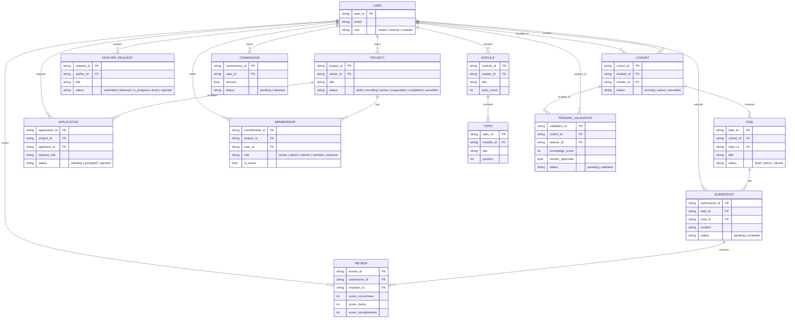

# E2E Test Coverage — Visual Overview

> This file covers **end-to-end (Playwright) tests only** located in `frontend/e2e/scenarios/`.
> Backend unit and integration tests are not described here.

86 tests across 15 spec files covering the complete user journey from authentication
(invite-only registration, cohort, learning, projects, features) including security settings,
credential management, profile editing, and referrals.

## Test Personas

| Persona    | Email               | Password      | Role                          |
|------------|---------------------|---------------|-------------------------------|
| `master`   | `master@e2e.test`   | `e2epassword` | Cohort creator                |
| `learner1` | `learner1@e2e.test` | `e2epassword` | Active cohort member          |
| `learner2` | `learner2@e2e.test` | `e2epassword` | Active cohort member          |
| `outsider` | `outsider@e2e.test` | `e2epassword` | Authenticated, not in cohort  |

Authenticated sessions are stored in `e2e/.auth/` (git-ignored) and reused across
all tests in a run without going through the login UI.

## Test Summary

| Spec file                                  | Tests | What it covers                                    |
|--------------------------------------------|------:|---------------------------------------------------|
| `auth/auth.spec.ts`                        |     3 | API login, invalid login, protected route          |
| `auth/auth-ui.spec.ts`                     |     5 | Register form (UI), login form (UI)               |
| `auth/invite.spec.ts`                      |    10 | Admin endpoint, invite-gated registration (API + UI) |
| `auth/linked-accounts.spec.ts`            |     2 | Security page, sign-in methods                   |
| `auth/profile-referrals.spec.ts`           |     5 | Referrals API (empty list, 401), profile UI section |
| `auth/update-profile.spec.ts`              |     4 | Edit display name, change email, duplicate email error, cancel |
| `cohort/access-control.spec.ts`          |     9 | Route guards, role-based UI visibility            |
| `cohort/cohort-lifecycle.spec.ts`          |     6 | Create → enrol → activate → cancel               |
| `cohort/task-flow.spec.ts`               |     6 | Create task → submit → peer review → master view  |
| `cohort/dashboard-validation.spec.ts`      |     4 | Pending competency card, validate, access denied  |
| `cohort/earnings.spec.ts`                  |     5 | Page structure, zero state, route protection      |
| `learning/module-lifecycle.spec.ts`      |     5 | Create module, list, add/remove topic, auth guard |
| `projects/project-lifecycle.spec.ts`      |     6 | Create, publish, public list, search, filter, activate |
| `projects/project-applications.spec.ts`   |     5 | Apply, accept, reject, change role, remove member |
| `features/feature-request-lifecycle.spec.ts` |   6 | Submit, public list, filter, plan, full lifecycle, reject |
| **Total**                                  |**86** |                                                   |

---

## Entity Relationship Diagram

---

## User Journey Flowchart

```mermaid
flowchart TB
    subgraph InviteFlow["🎟️ Invite Flow  ·  auth/invite.spec.ts  (10 tests)"]
        IV1([Admin]) -->|POST /admin/invite-codes + valid secret| IV2[Batch of codes returned]
        IV3([Admin]) -->|POST /admin/invite-codes, no secret| IV4[403 Forbidden]
        IV5([Admin]) -->|POST /admin/invite-codes, wrong secret| IV6[403 Forbidden]
        IV7([New user]) -->|POST /auth/register + valid invite_code| IV8[Account created]
        IV9([New user]) -->|POST /auth/register, no invite_code| IV10[422 Unprocessable]
        IV11([New user]) -->|POST /auth/register, unknown code| IV12[422 Unprocessable]
        IV13([New user]) -->|POST /auth/register, used code| IV14[422 Unprocessable]
        IV15([New user]) -->|Register form, empty invite field → Submit| IV16[Inline error shown]
        IV17([New user]) -->|Register form, invalid code → Submit| IV18[Inline error shown]
        IV19([New user]) -->|Register form, valid code → Submit| IV20[Account created — dashboard]
    end

    subgraph Referrals["👥 Profile Referrals  ·  auth/profile-referrals.spec.ts  (5 tests)"]
        RF1([Any user]) -->|GET /auth/referrals, no token| RF2[401 Unauthorized]
        RF3([outsider]) -->|GET /auth/referrals| RF4[Empty list — total 0]
        RF5([outsider]) -->|/profile → People I Invited| RF6["You haven't invited anyone yet."]
        RF7([master]) -->|GET /auth/referrals| RF8[Returns list or empty]
        RF7 -->|/profile → People I Invited| RF9[Shows count + names if any]
    end

    subgraph UpdateProfile["✏️ Update Profile  ·  auth/update-profile.spec.ts  (4 tests)"]
        UP1([Any user]) -->|/profile → Edit Profile| UP2[Form opens with current values]
        UP2 -->|Change display name → Save| UP3[New name shown, form closes]
        UP2 -->|Change email → Save| UP4[New email shown in store and UI]
        UP2 -->|Email already taken → Save| UP5[Inline error, form stays open]
        UP2 -->|Cancel| UP6[Original values restored, form closes]
    end

    subgraph AuthLogin["🔐 Authentication  ·  auth/auth.spec.ts  (3 tests)"]
        AL1([New user]) -->|POST /auth/register| AL2[Account created]
        AL2 -->|POST /auth/login| AL3[Token received]
        AL4([Wrong password]) -->|POST /auth/login| AL5[Error: Invalid credentials]
        AL6([Unauthenticated]) -->|GET /dashboard| AL7[Redirect → /login]
    end

    subgraph AuthUI["🖥️ Auth UI  ·  auth/auth-ui.spec.ts  (5 tests)"]
        UI1([New user]) -->|Register form| UI2[Account created — dashboard redirect]
        UI3([Duplicate email]) -->|Register form| UI4[Error: email already taken]
        UI5([Existing user]) -->|Login form| UI6[Logged in — dashboard redirect]
        UI7([Wrong password]) -->|Login form| UI8[Error: invalid credentials]
        UI9([Unknown email]) -->|Login form| UI10[Error: invalid credentials]
    end

    subgraph LinkedAccounts["🔒 Linked Accounts  ·  auth/linked-accounts.spec.ts  (2 tests)"]
        LA1([master]) -->|/settings/security| LA2[Security page loads]
        LA2 --> LA3[Credential cards visible]
        LA2 --> LA4["Set Password" button if no local]
    end

    subgraph Access["🔒 Access Control  ·  cohort/access-control.spec.ts  (9 tests)"]
        A1([Unauthenticated]) -->|GET /cohorts| A2[/Redirect → /login/]
        A1 -->|GET /cohorts/new| A2
        A1 -->|GET /me/earnings| A2

        A3([master]) -->|cohort page| A4[Dashboard link visible]
        A5([learner]) -->|cohort page| A6[Dashboard link hidden]
        A7([outsider]) -->|cohort page| A8[Page loads, no Enrol form]

        A3 -->|forming cohort| A9[Activate button visible]
        A3 -->|active cohort| A10[Begin Completing button visible]
        A3 -->|GET /cohorts/:id/dashboard| A11[Dashboard page loads]
    end

    subgraph Cohort["📋 Cohort Lifecycle  ·  cohort/cohort-lifecycle.spec.ts  (6 tests)"]
        C1([master]) -->|/cohorts/new form| C2[Cohort created]
        C2 --> C3[Status: forming]
        C3 -->|Enrol form| C4[learner1 added to members list]
        C3 -->|Activate button| C5[Status: active]
        C3 -->|Cancel button| C6[Status: cancelled — no action buttons]
        C4 --> C7([learner1])
        C7 -->|/cohorts list| C8[Cohort visible before activation]
        C5 --> C9([learner1])
        C9 -->|cohort page| C10[active badge visible]
    end

    subgraph Task["✅ Task Flow  ·  cohort/task-flow.spec.ts  (6 tests)"]
        T1([master]) -->|+ Create Task form| T2[Task created]
        T2 --> T3[Status: draft]
        T3 -->|learner1 on tasks tab| T4[No Submit Solution button]
        T3 -->|Activate button| T5[Status: active]
        T5 -->|learner1 Submit Solution| T6[Solution submitted]
        T6 --> T7[Status: submitted]
        T7 -->|learner2 Review button| T8[Peer review form opens]
        T8 -->|Submit Review| T9[Review recorded]
        T6 --> T10([master])
        T10 -->|tasks tab| T11[Sees learner1 + learner2 user IDs]
    end

    subgraph Dashboard["📊 Dashboard Validation  ·  cohort/dashboard-validation.spec.ts  (4 tests)"]
        D1([learner1]) -->|submits solution ×2| D2[2 submissions]
        D3([learner2]) -->|reviews both| D4[2 peer reviews]
        D2 & D4 --> D5[Pending Competency Validation created]
        D5 --> D6([master])
        D6 -->|/dashboard| D7[Sees pending validation card with learner1 ID]
        D7 -->|score 101| D8[Validate button disabled]
        D7 -->|score 80 + mentor ✓| D9[Click Validate]
        D9 --> D10[Competency validated ✓]
        D11([learner1]) -->|/dashboard| D12[Access denied message]
    end

    subgraph Earnings["💰 Earnings Page  ·  cohort/earnings.spec.ts  (5 tests)"]
        E1([master]) -->|/me/earnings| E2[My Earnings heading]
        E2 --> E3[Pending 0.00 · Released 0.00]
        E2 --> E4[No commissions yet.]
        E2 --> E5[No Release button]
        E6([learner1]) -->|/me/earnings| E7[My Earnings heading]
        E7 --> E8[No commissions yet.]
    end

    subgraph Modules["📚 Module Lifecycle  ·  learning/module-lifecycle.spec.ts  (5 tests)"]
        ML1([master]) -->|/modules/new form| ML2[Module created]
        ML2 --> ML3[Redirect → /modules/:id]
        ML4([master]) -->|/modules list| ML5[New module card visible]
        ML3 -->|Add Topic form| ML6[Topic added — appears in list]
        ML3 -->|Remove button| ML7[Topic removed — disappears]
        ML8([Unauthenticated]) -->|GET /modules| ML9[/Redirect → /login/]
    end

    subgraph Projects["🚀 Project Lifecycle  ·  projects/project-lifecycle.spec.ts  (6 tests)"]
        PL1([master]) -->|/projects/new form| PL2[Project created]
        PL2 --> PL3[Status: draft]
        PL3 -->|Publish button| PL4[Status: recruiting]
        PL5([Unauthenticated]) -->|GET /| PL6[Projects page loads]
        PL7([learner1]) -->|keyword search| PL8[Matching project visible]
        PL7 -->|Recruiting filter| PL9[Only recruiting projects shown]
        PL4 -->|Activate button| PL10[Status: active]
    end

    subgraph Applications["📝 Project Applications  ·  projects/project-applications.spec.ts  (5 tests)"]
        AP1([learner1]) -->|Apply to join| AP2[Application submitted]
        AP2 --> AP3([master])
        AP3 -->|Accept button| AP4[Status: accepted]
        AP3 -->|Reject button| AP5[Status: rejected]
        AP4 -->|Change role select| AP6[Role updated]
        AP4 -->|Remove button| AP7[Member removed]
    end

    subgraph Features["✨ Feature Requests  ·  features/feature-request-lifecycle.spec.ts  (6 tests)"]
        FR1([master]) -->|/features/new form| FR2[Feature request created]
        FR2 --> FR3[Status: Submitted]
        FR4([Unauthenticated]) -->|GET /features| FR5[List visible, no Submit button]
        FR6([master]) -->|Submitted filter| FR7[Only submitted requests shown]
        FR3 -->|Plan button| FR8[Status: Planned]
        FR8 -->|Start Work| FR9[Status: In Progress]
        FR9 -->|Mark Done| FR10[Status: Done]
        FR3 -->|Reject button| FR11[Status: Rejected]
    end

    AuthLogin ~~~ AuthUI
    AuthUI ~~~ InviteFlow
    InviteFlow ~~~ Referrals
    Referrals ~~~ UpdateProfile
    UpdateProfile ~~~ LinkedAccounts
    LinkedAccounts ~~~ Access
    Access ~~~ Cohort
    Cohort ~~~ Task
    Task ~~~ Dashboard
    Dashboard ~~~ Earnings
    Earnings ~~~ Modules
    Modules ~~~ Projects
    Projects ~~~ Applications
    Applications ~~~ Features
```

