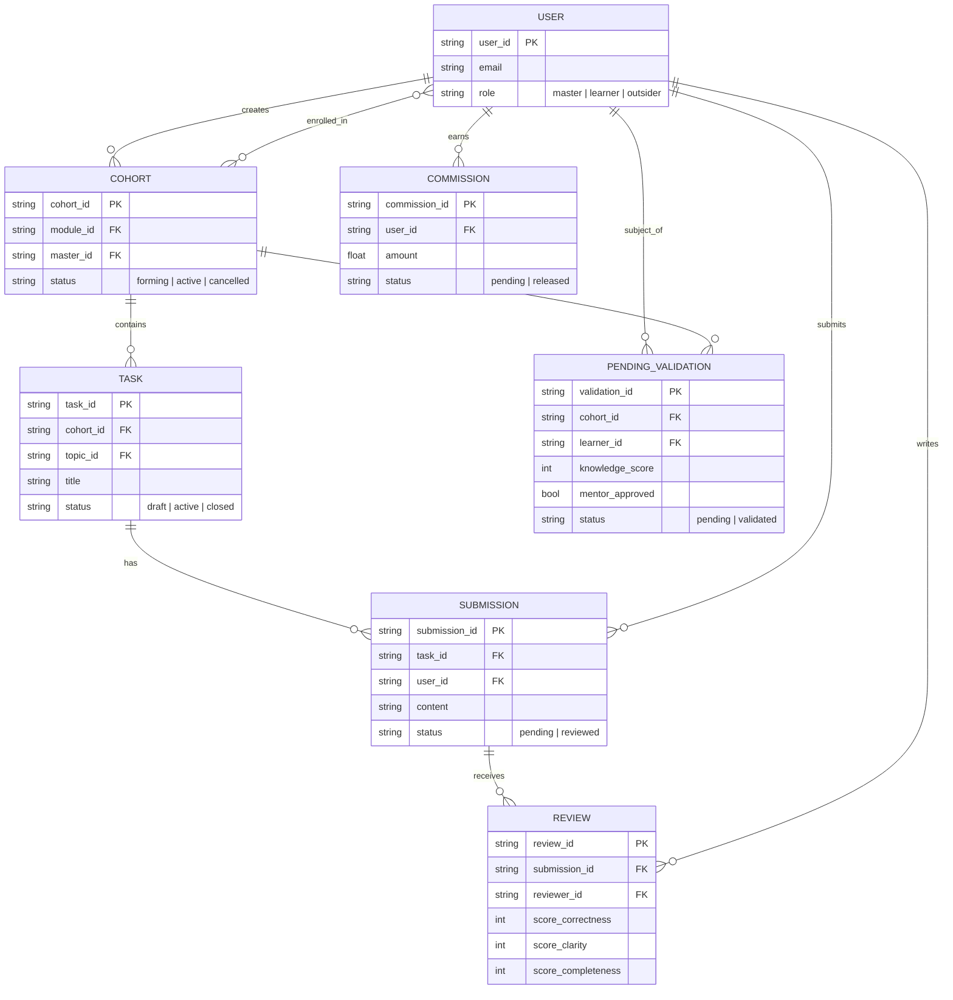
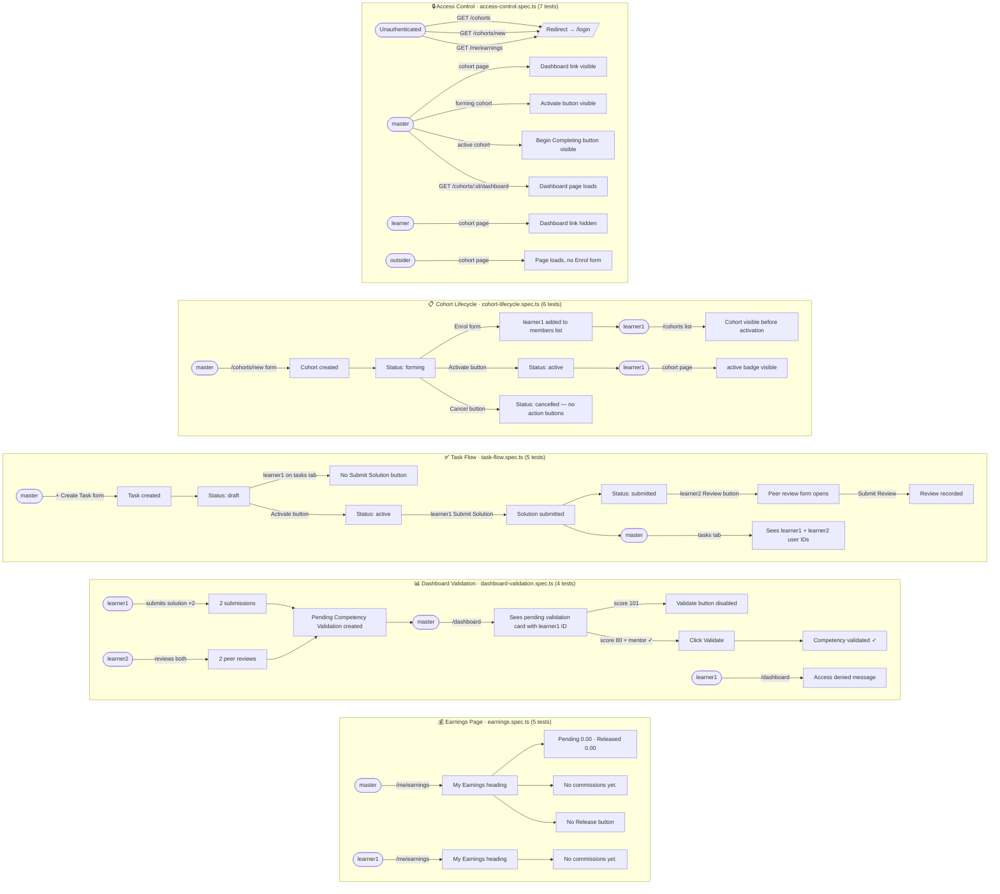

# E2E Test Coverage — Visual Overview

30 tests across 5 spec files covering the complete user journey from authentication
to cohort management, task execution, peer review, competency validation, and earnings.

## Test Personas

| Persona    | Email               | Password      | Role                          |
|------------|---------------------|---------------|-------------------------------|
| `master`   | `master@e2e.test`   | `e2epassword` | Cohort creator                |
| `learner1` | `learner1@e2e.test` | `e2epassword` | Active cohort member          |
| `learner2` | `learner2@e2e.test` | `e2epassword` | Active cohort member          |
| `outsider` | `outsider@e2e.test` | `e2epassword` | Authenticated, not in cohort  |

Authenticated sessions are stored in `e2e/.auth/` (git-ignored) and reused across
all tests in a run without going through the login UI.

## Test Summary

| Spec file                          | Tests | What it covers                                    |
|------------------------------------|------:|---------------------------------------------------|
| `access-control.spec.ts`           |     7 | Route guards, role-based UI visibility            |
| `cohort-lifecycle.spec.ts`         |     6 | Create → enrol → activate → cancel               |
| `task-flow.spec.ts`                |     5 | Create task → submit → peer review → master view  |
| `dashboard-validation.spec.ts`     |     4 | Pending competency card, validate, access denied  |
| `earnings.spec.ts`                 |     5 | Page structure, zero state, route protection      |
| **Total**                          |**30** |                                                   |

---

## Entity Relationship Diagram

---

## User Journey Flowchart

